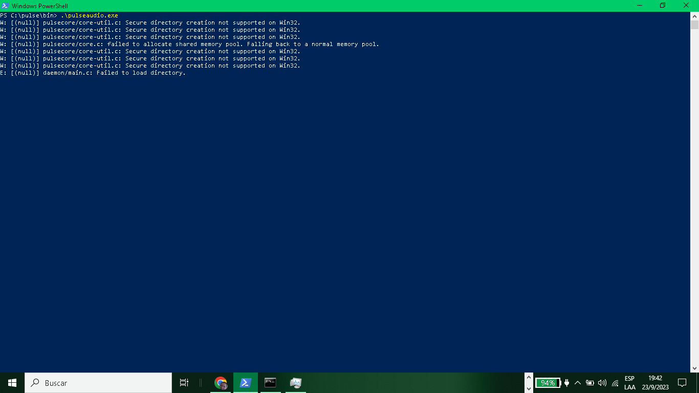
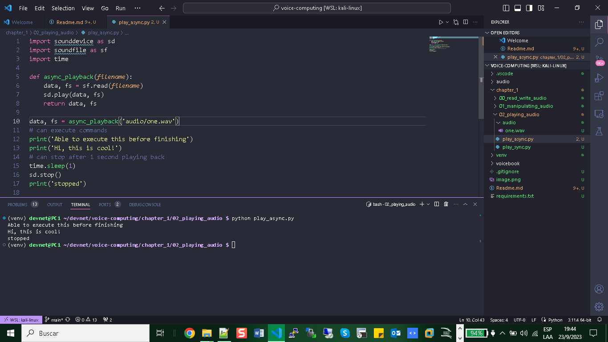

# VOICE COMPUTING

# Chapter 1 - Voice Computing Fundamentals

Fundamentals:

+ Mic selection - sound in electrical signal amps C/s
+ Saving and Manipulating Audio Files
+ Audio Codecs
+ Compress Audio

--- mic -> sound card (Audio data IN / OUT) --- SEND ANALOG FORMAT (amps C/s) OR DIGITAL FORMAT (linear PCM data) --- > through buses.
--- playback -> speakers or headphones --- sound card change DIGITAL FORMAT to ANALOG FORMAT
--- convert digital stream an audio codec is a software program used to encode and decode (pcm data -- wav -- pcm data).
--- an audio coding format is output file type of signal digital to .wav
--- audio transcoding convert to different audio coding format. wav to mp3

--- audio channel -- reperesent number audio in and out to record audio signal.--- stereo and mono.

In short, to play mono or stereo audio, you need a speaker. Speakers convert electrical signals into sound and can be customized with multiple drivers to enhance audio quality by dividing frequencies into tweeters 2000 20000 Hz (highs), midrange drivers (mids) 250 - 2000 Hz, and woofers (lows) 40 - 500 Hz. Mono audio plays the same on all speakers, while stereo uses independent channels for a more immersive experience. Optionally, subwoofers are drivers added separately from the loudspeaker enclosure to reproduce ultra low frequencies <200 Hz.

# Read Write Audio

Read and write Audio Files

# Library PyDub

+ Install: sudo apt-get install ffmpeg
+ pip install pydub

```python
from pydub import AudioSegment
# read/write data convert format
data = AudioSegment.from_wav("audio/one.wav")
data.export("audio/new_one.wav")
```

+ sample rate = (samples/sec)
+ raw data samples = (numeric value frames) --- reflect power amplitude of the signal

# Manipulating Audio Files

+ install sudo apt-get install sox libsox-dev
+ pip install sox

```python
import os
# change channel audio one.wav to stereo.wav
os.system('sox audio/one.wav -c 2 audio/stereo.wav')
# combine two audios and the output file is three.wav
os.system('sox audio/stereo.wav audio/two.wav audio/three.wav')
# increase volumen
os.system('sox -v 4.0 audio/three.wav audio/volup.wav')
# trim = cut specific part of the audio 3 sec
os.system('sox audio/volup.wav audio/trim.wav trim 0 3')
# reverse
os.system('sox audio/volup.wav audio/reverse.wav reverse')

```

# Playing Audio

Synchronous playback: Audio plays within Python code and blocks other code.
Asynchronous playback: Allows executing background code while audio plays.

# Synchronous

pip install pygame

```python
import pygame

def sync_playback(filename):
    pygame.mixer.init()
    pygame.mixer.music.load(filename)
    pygame.mixer.music.play()

sync_playback('audio/one.wav')

```

# Asynchronous

sudo apt install libpulse0
sudo apt-get install pulseaudio
sudo apt-get install alsa-utils -y
sudo pulseaudio --start -v
W: [pulseaudio] main.c: This program is not intended to be run as root (unless --system is specified).
I: [pulseaudio] main.c: Daemon startup successful.
aplay -l
aplay: device_list:277: no soundcards found...

then doing his steps in Windows 10:

https://x410.dev/cookbook/wsl/enabling-sound-in-wsl-ubuntu-let-it-sing/





pip install sounddevice

```python
import sounddevice as sd
import soundfile as sf
import time

def async_playback(filename):
    data, fs = sf.read(filename)
    sd.play(data, fs)
    return data, fs

data, fs = async_playback('audio/one.wav')
# can execute commands
print('Able to execute this before finishing')
print('Hi, this is cool!')
# can stop after 1 second playing back
time.sleep(1)
sd.stop()
print('stopped')
```
# Record Async

```python
import sounddevice as sd
import soundfile as sf
import time

def printstuff(number):
    for i in range(number):
        print(i)

def async_record(filename, duration, fs, channels):
    print('recording')
    myrecording = sd.rec(int(duration * fs), samplerate=fs, channels=channels)
    print('can to execute this before finishing')
    printstuff(30)

    sd.wait()
    sf.write(filename, myrecording, fs)
    print('done recording')

async_record('async_record.wav', 10, 16000, 1)

```
# Converting Audio Formats

