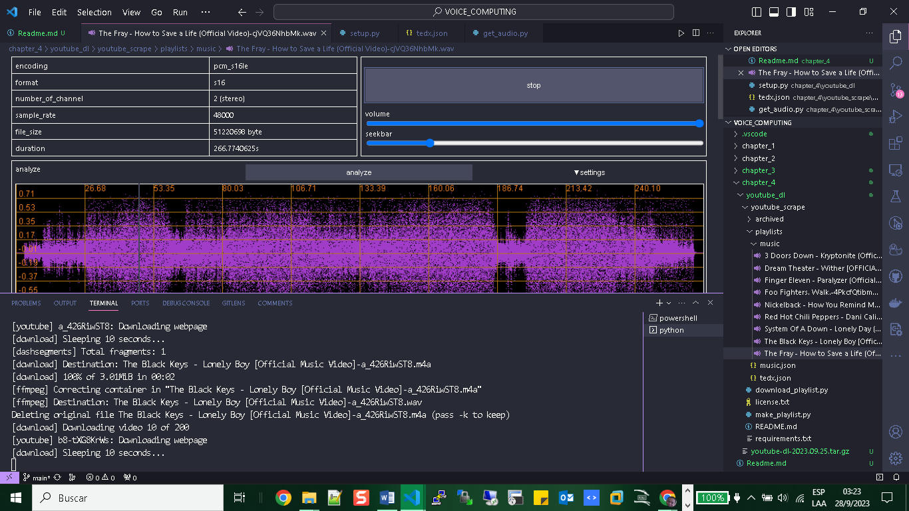

# DATA MODELING

# YOU TUBE SCRAPE

```bash
sudo pip3 install youtube-dl
```

```bash
sudo pip3 install youtube-dl --upgrade
```

+ Download https://github.com/ytdl-org/ytdl-nightly/releases

```bash
$ python -m pip install --force-reinstall youtube-dl-2023.09.25.tar.gz
```

```bash
git clone https://github.com/jim-schwoebel/youtube_scrape.git
```

```bash
pip install -r requirements.txt
```

```bash
cd ~
cd youtube_scrape 

```

```bash
$ python make_playlist.py

```

```bash
    what do you want to name this playlist (e.g. angry)?music

    what is the playlist id or URL?https://www.youtube.com/watch?v=xPU8OAjjS4k&list=PLpoUYdDxb6P56t8lnxnA412k_H5EMHd-8

    what is the playlist id or URL?
```

```bash
$ python download_playlist.py music.json
-----------------
Which playlist would you like to download?
music.json
-----------------
music.json
...
```



# REFERENCES

+ https://www.ubuntupit.com/how-to-install-and-use-youtube-dl-on-linux-system/
+ https://github.com/jim-schwoebel/youtube_scrape
+ https://github.com/ksingla025/pyAudioAnalysis3/tree/master