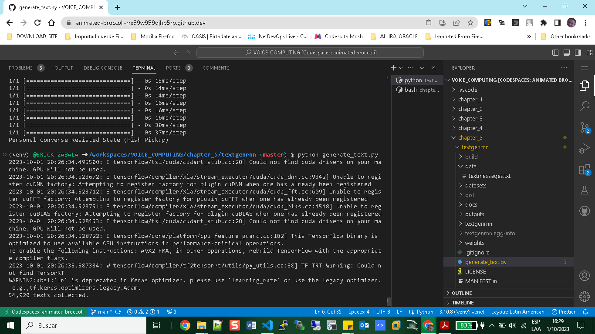

# Textgenrnn

+ Install Generative Text

```bash
 $ git clone https://github.com/minimaxir/textgenrnn.git
 $ cd textgenrnn
 $ pip install --upgrade pip
 $ python setup.py install
```
+ Load Messages in folder data: textmessages.txt

+ Testting 
```bash
(venv) @ERICK-ZABALA ➜ /workspaces/VOICE_COMPUTING/chapter_5/textgenrnn (master) $ python generate_text.py 
```
```python
from textgenrnn import textgenrnn

textgen = textgenrnn()

try:
    textgen.train_from_file('data/textmessages.txt', num_epochs=1)
except Exception as e:
    print(f"Error during training: {e}")

newmsgs = list()
for i in range(10):
    try:
        newmsg = textgen.generate()
        newmsgs.append(newmsg)
    except Exception as e:
        print(f"Error during text generation: {e}")

```
