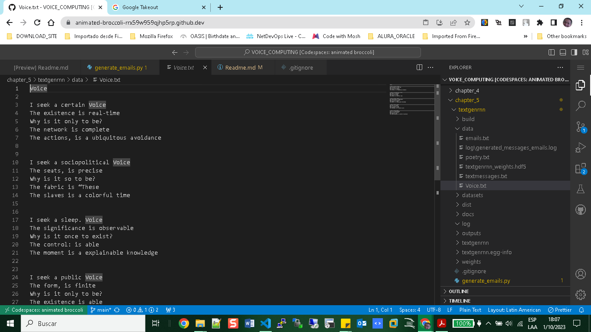

# Textgenrnn

+ Install Generative Text

```bash
 $ git clone https://github.com/minimaxir/textgenrnn.git
 $ cd textgenrnn
 $ pip install --upgrade pip
 $ python setup.py install
```
+ Load Messages in folder data: textmessages.txt

+ Testting 
```bash
(venv) @ERICK-ZABALA ➜ /workspaces/VOICE_COMPUTING/chapter_5/textgenrnn (master) $ python generate_text.py 
```
```python
from textgenrnn import textgenrnn

textgen = textgenrnn()

try:
    textgen.train_from_file('data/textmessages.txt', num_epochs=1)
except Exception as e:
    print(f"Error during training: {e}")

newmsgs = list()
for i in range(10):
    try:
        newmsg = textgen.generate()
        newmsgs.append(newmsg)
    except Exception as e:
        print(f"Error during text generation: {e}")

```


# Generative Poem

+ pip install textblob
+ pip install nltk

```python
Python 3.10.8 (main, Sep 13 2023, 16:52:46) [GCC 9.4.0] on linux
Type "help", "copyright", "credits" or "license" for more information.
>>> import ntlk
Traceback (most recent call last):
  File "<stdin>", line 1, in <module>
ModuleNotFoundError: No module named 'ntlk'
>>> import nltk
>>> nltk.download('averaged_perceptron_tagger')
[nltk_data] Downloading package averaged_perceptron_tagger to
[nltk_data]     /home/codespace/nltk_data...
[nltk_data]   Unzipping taggers/averaged_perceptron_tagger.zip.
True
>>> exit()

```
+ Running:

```bash
$ python generate_poem.py
```

```python
(venv) @ERICK-ZABALA ➜ /workspaces/VOICE_COMPUTING/chapter_5/textgenrnn (master) $ python generate_poem.py

would you like a random poem? 
n
what is the name of the poem? (noun) 
voice
what is the description? 
a short poem about voices

```



# Text Summary

+ pip install sumy

```python
Python 3.10.8 (main, Sep 13 2023, 16:52:46) [GCC 9.4.0] on linux
Type "help", "copyright", "credits" or "license" for more information.
>>> import nltk
>>> nltk.download('punkt')
[nltk_data] Downloading package punkt to /home/codespace/nltk_data...
[nltk_data]   Unzipping tokenizers/punkt.zip.
True
>>> exit()

```
Running Code:

```bash
$ python generate_summary.py
```

```bash
(venv) @ERICK-ZABALA ➜ /workspaces/VOICE_COMPUTING/chapter_5/textgenrnn (master) $ python generate_summary.py 

what file type is this (t) for text, (w) for website. 
w
what link would you like to summarize on Wikipedia? 
https://en.wikipedia.org/wiki/Information_technology

Based on the storage and processing technologies employed, it is possible to distinguish four distinct phas ...
```

# Make Chaterbot

+ pip install chatterbot

+ git clone https://github.com/gunthercox/ChatterBot.git